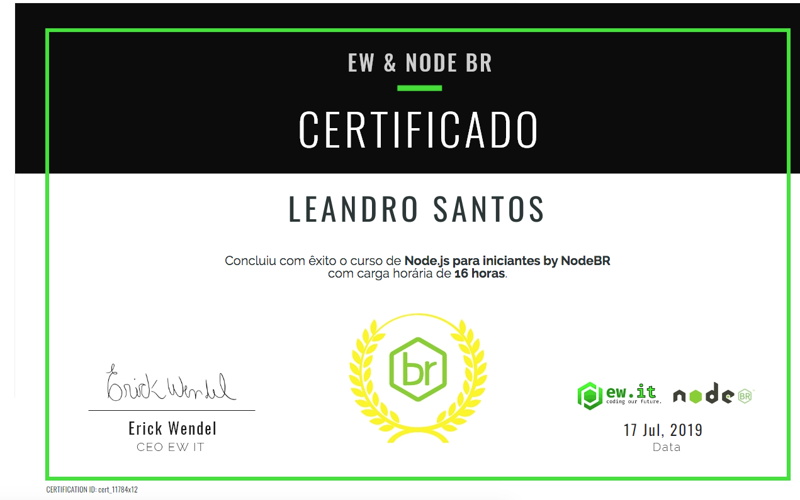

<h1 align="center">
     <a href="#" alt="">Curso nodeBR</a>
</h1>

<h4 align="center">
	🚧   Concluído 🚀 🚧
</h4>

Tabela de conteúdos
<!--ts-->
   * [Sobre o projeto](#-sobre-o-projeto)
   * [Funcionalidades](#-funcionalidades)
   * [Layout](#-layout)
   * [Como executar o projeto](#-como-executar-o-projeto)
     * [Pré-requisitos](#pré-requisitos)
     * [Rodando o Projeto](#user-content--rodando-o-projeto)
   * [Tecnologias](#-tecnologias)
<!--te-->

## 💻 Sobre o projeto

Projeto baseado no curso do [Erick Wendel](https://cursos.nodebr.org/p/node-js-para-iniciantes-nodebr), este curso foi desenvolvido sob medida baseado em uma pesquisa sobre o que a comunidade brasileira mais necessita, suas principais dificuldades e desafios. 

Sobre esse projeto tem desde o ciclo de vida Javascript, manipulação de listas ao desenvolvimento real de aplicações em ambiente de produção.

Foram desenvolvidos conceitos como desenvolvimento orientado a testes, autenticação, autorização, documentação de serviços e gerenciamento de variáveis de ambiente (environments) de aplicações.

---

## ⚙️ Funcionalidades

Foco desde básico Javascript, ao avaçado com node.js em ambiente de produção como:

- [x] Ciclo de vida, 
- [x] Variáveis, 
- [x] Métodos, 
- [x] Classes e funções 
- [x] Tipos de dados, 
- [x] Null,Undefined e expressões booleanas,
- [x] Estruturas de repetição,
- [x] Manipulação de listas,
- [x] Dominar funções assíncronas 
- [x] Ambiente de produção.
- [x] Desenvolvimento orientado a testes.
- [x] Autenticação, autorização, documentação de serviços 
- [x] Gerenciamento de variáveis de ambiente (environments) de aplicações

  O projeto foi separado em pastas para fica mais organizado cada pasta funciona de forma independentemente, onde existe também explicações/comentários no meio do código

---

## 🎨 Layout

O layout da aplicação em um navegador

<p align="center">
  

  
</p>

---

## 🚀 Como executar o projeto
### Pré-requisitos

Antes de começar, você vai precisar ter instalado em sua máquina as seguintes ferramentas:
[Git](https://git-scm.com), [Docker](https://docs.docker.com/engine/install/ubuntu/), [Node na versão 10.19.0](https://nodejs.org/en/)

Além disto é bom ter um editor para trabalhar com o código como [VSCode](https://code.visualstudio.com/) e também um navegador/Browser de sua escolha eu escolhi [Chorme](https://www.google.pt/intl/pt-PT/chrome/?brand=CHBD&gclid=CjwKCAjw1ej5BRBhEiwAfHyh1CqpdiJkRowiF7qVChVWvkTImra14_fVqzdcxXeYoznuxbgYMmtS9BoCP4oQAvD_BwE&gclsrc=aw.ds)

#### 🎲 Rodando o Projeto

```bash
# Clone este repositório
$ git clone git@github.com:leandrojsantos/node-br.git

# Acesse a pasta do projeto no terminal/cmd
$ cd node-br/<nome-da-pasta-desejada>

# Acesse a pasta do projeto com nome de back-end-node

# Abrir o arquivo README.md seguir os passos nele descritos.
 
# Tenha certeza que os passos do README.md da pasta back-end-node estão em serviço.

```
---

## 🛠 Tecnologias

As seguintes ferramentas foram usadas na construção do projeto:

**Server**  
* [Git](https://git-scm.com) 
* [VSCode](https://code.visualstudio.com/)
* [Javascript](https://developer.mozilla.org/pt-BR/docs/Aprender/JavaScript)
* [Chorme](https://www.google.pt/intl/pt-PT/chrome/?brand=CHBD&gclid=CjwKCAjw1ej5BRBhEiwAfHyh1CqpdiJkRowiF7qVChVWvkTImra14_fVqzdcxXeYoznuxbgYMmtS9BoCP4oQAvD_BwE&gclsrc=aw.ds)
* [Docker](https://docs.docker.com/engine/install/ubuntu/)
* [Node na versão 10.19.0](https://nodejs.org/en/)

**Utilitários**

[Curso Completo](https://cursos.nodebr.org/p/node-js-para-iniciantes-nodebr)

[Nerdzao](https://nerdzao.netlify.com/)

[Meetup](https://www.meetup.com/pt-BR/Javascript-SP)

Certificado do curso 

